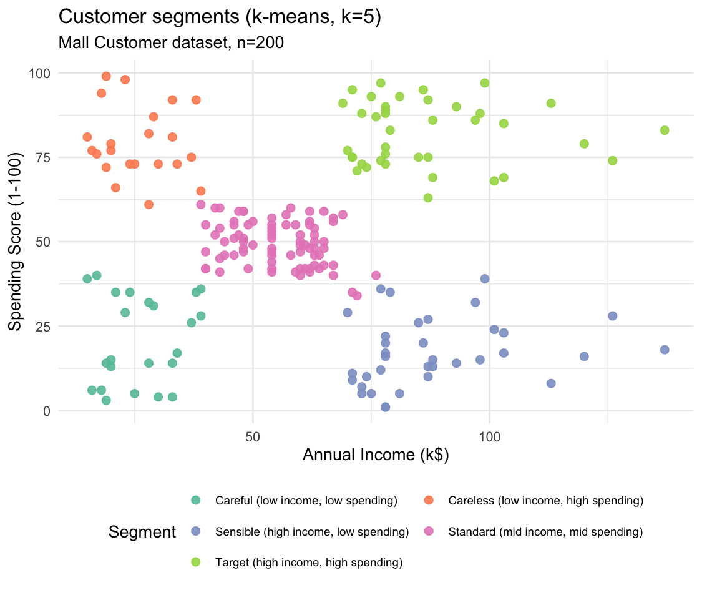

# Customer Segmentation in R

K-means clustering to segment 200 retail customers by income and spending
behaviour, so marketing spend can be targeted differently per segment
instead of treating every customer the same.

## Data

Public "Mall Customer" dataset (`Mall_Customers.csv`, 200 rows): CustomerID,
Gender, Age, Annual Income (k$), Spending Score (1-100).

## Method

1. **Explore** — plot income vs. spending score before assuming any structure (`plot_1_explore.png`).
2. **Choose k** — scale the two variables and run k-means for k = 1..10;
   use the elbow method to pick the point where adding another cluster
   stops meaningfully reducing within-cluster variance (`plot_2_elbow.png`).
   → k = 5.
3. **Cluster** — run k-means with k = 5, then label each cluster by its
   average income/spending profile rather than leaving it as "cluster 1, 2, 3…".

## Result

| Segment | Profile | n |
|---|---|---|
| Target | High income, high spending | 39 |
| Sensible | High income, low spending | 35 |
| Standard | Mid income, mid spending | 81 |
| Careless | Low income, high spending | 22 |
| Careful | Low income, low spending | 23 |



## Business takeaway

**Target** and **Careless** customers spend the most relative to what a
generic campaign costs to reach them — worth the marketing budget.
**Sensible** customers have the income but don't respond to spend-more
messaging, so a loyalty or status-based offer likely works better than a
discount. **Standard** is the largest group (81 of 200) and the baseline
against which any targeted campaign should be measured.

## Run it

```r
install.packages(c("ggplot2", "dplyr"))
Rscript customer_segmentation.R
```

Outputs: `plot_1_explore.png`, `plot_2_elbow.png`, `plot_3_segments.png`,
`segmentation_summary.txt`.
